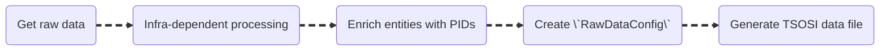

The data directory is organized in sub-directories corresponding to the different stages of our workflow.

# [Data preparation](./preparation/)

This contains the code to prepare any input data to be ingested in our database.

We use dedicated python notebooks per infrastructure or per dataset type.
The data preparation is currently only performed locally.

The following diagram summarizes the preparation process:

## Raw data source

All our partners provide data in the form of .xlsx spreadsheets except for SciPost where we use a dedicated API with private credentials, see `get_scipost_raw_data` in [get_data.py](./preparation/scipost/get_data.py).

All the data files at different stage are stored on the UGA cloud, with private access.

## Infra-dependent processing

We have a custom data processing for each of our partners, and sometimes multiple different processing per partner when the data format changes throughout the years.

This processing includes:

- The `selection` or `filtering` of the actual transfers according to specific criterias implemented with the partner's insights.

- The `reshaping` of the transfer data, e.g., for the DOAB where the data comes as the amount of support per year when we want the distinct individual transfers.

- Some little processing to match our available inputs, see more in `RawDataConfig` below.

Note that this step and the enrichment step are sometimes inverted, or an additional infra-dependent processing might take place after the enrichment. 

Each infrastructure has a dedicated repository with a README.md file describing the custom processing.

## Enrich entities with PIDs

We enrich the supporter and intermediary fields with ROR or Wikidata identifiers.

Usually, we have three steps to perform this enrichment:

1. Run the [pid_matching.prepare_manual_matching](./pid_matching.py) to pre-match the entities to the ROR. This uses the [ROR affiliation API](https://ror.readme.io/docs/api-affiliation) and derives whether the given match can be automatically trusted.

    If the spreadsheet has intermediary data, it should also be pre-matched.
    I usually put the supporter matching results directly in the original dataset in a spreadsheet named `Transfers`, and the intermediary matching result in a separate sheet called `Consortiums`.

2. Export and upload the resulting results to a google sheet. We continue the enrichment there to use our custom [google_sheet_script.gs](./manual_review/google_sheet_script.js).

    This step consists in verifying untrusted affiliation results and adding Wikidata IDs when nor ROR record exists.

3. Download the enriched data and process it using [pid_matching.process_enriched_data](./pid_matching.py).

    As in step 1., the processing should also be performed on intermediaries/consortiums, if any.

Note that SciPost data enrichment process is different, cf. its dedicated [notebook](./preparation/scipost/run.ipynb).

## Create RawDataConfig

This is the core feature of our data preparation.

For each dataset to prepare, we define a custom configuration object, [`RawDataConfig`](./preparation/raw_data_config.py), that maps the input fields to our database models, along with information on how to process the fields (default value, value format, ...).
The same config can be re-used when the datasets are the same.
The fields to be mapped are the ones resulting from the above processing steps.

This also requires extra arguments:

- A valid `source` name.
- An optional year (when the data is for a given year).
- The path to the "raw" (or prepared) dataset. 

The class exposes methods to clean and import the data. 

## Generate TSOSI data file

The final step is to generate a `.json` file in a specific format that can be ingested in the next step.

This is simply done by calling the `generate_data_file` method of the `RawDataConfig` object.

It is responsible for parsing and performing various checks on the data. Errors will be raised if the provided data does not suit our standard. For example, the following cases should raise an error/warning:

* No date value (at least one date is mandatory).

* An amount is provided without a currency.

* The provided currency does not fit our sublist of supported currencies (in [ISO 4217](https://en.wikipedia.org/wiki/ISO_4217) format).

* The provided country cannot be mapped to an actual country using pycountries.

* ...

The output file of this preparation is ready to be ingested in our database.

## Notes and ideas on the data preparation

**Raw data quality**

The partnership with DOAJ and DOAB has been quite tedious due to the errors in the provided data.
This has lead to numerous correction of the input (raw) data which, in turn, led to re-performing entity matching which is time consuming.

Additionally, due to the constraint on the data to ingest (one dataset per year per data source, e.g., only 1 data file for DOAJ libraries in 2023), we had to manually merge the partial extract of corrected transfers with base data into a single file multiple times, which was also tedious.

I propose the following as improvements.

**Provided data improvement**

- TSOSI needs to require an exhaustive and curated dataset of transfers from the data providers. This should not be our work to derive them from whatever data source we are provided with.

    I believe the idea was to try and work with whatever material the infrastructures could provide (mainly accounting/budget reports) to lessen the amount of work from them.
    
    We should not be the one to question the provided data.

- The data preparation process should be a part of TSOSI's platform. The workflow could be something like:

    1. Upload a dataset
    2. Configure the field mapping, basically the underlying `RawDataConfig` object
    3. Check the input data with config is valid - Required to go further.
    3. OPTIONNAL - Request data enrichment via a button or smthg
    4. OPTIONNAL - Perform manual review
    5. Request ingestion of the prepared and verified dataset

**Single file per year per source constraint**

We need to remove this constraint with the following upgrades:

- We need a solid process of transfer de-duplication. When that is available, we should not be worried anymore about ingesting twice the same dataset as it will be flagged as duplicated and thus discarded or at least ignored.

- Additionally The platform should offer a way to explore and correct the data for the trusted users.

# [Data ingestion](./ingestion/)

This contains the code to ingest a prepared dataset of transfers in the database.

## Data format & source validation

- Parse the file to the expected data format.

- Validate that the dataset can be ingested. The dataset won't be validated when it has an associated year and there already exists another `DataLoadSource` with full data for that given source and year.   

## Pre-match entities with existing ones

Match the given entities with the ones in the database. The matching is made on the attached identifiers, name and country.

An entity with an identifier can only match or be matched to an entity with an identifier.
Reversely , an entity without identifier can only match or be matched  to an entity without identifier.

## Create database records

- Create Entities and related identifiers without match
- Create Transfers and matching data. 

**Note:** There's no check on the potential duplications of transfers. That's why we currently empty and refill the database when some data changes or has been corrected.

## Send "transfers created" event

Send the [transfers_created](./signals.py) and [identifiers_created](./signals.py) django signals.
Automated tasks are triggered based on that signal.

# [Data enrichment](./enrichment/)

This contains the code to enrich our dataset with external sources.

This is wrapped by defined [Celery tasks](/backend/tsosi/tasks.py) and scheduled using Celery Beat.
Some tasks are directly invoked when relevant signals are sent. See [signals.py](./signals.py) or the chart below.

The scheduled tasks are defined in the `TSOSI_CELERY_BEAT_SCHEDULE` setting.

Here is the tasks and signals workflow:

The enrichment consists in:

* Fetching of external PID records (ROR, Wikidata).
* Fetching of wikipedia extract and wikidata logo files.
* Processing of the above data.

The code is split in 2 files:

- [database_related.py](./enrichment/database_related.py) - Methods that do not request external resources. They're in blue in the above chart.

- [api_related.py](./enrichment/api_related.py) - Methods relying on external data fetching. They're in red in the above chart.

Ideally, one should split each task realated code into one file and create a template "task core" class (the core of the task, separately of Celery tasks), given that everything does quite the same: select data to work with, perform method-specific stuff, log things, ...

## PID records fetching

The requests made to the registries are throttled using the token bucket algorithm implemented in [TokenBucket](./token_bucket.py).
The tasks are automatically re-scheduled when they're throttled, see [TsosiTask](./tasks.py).

## [Currencies](data/currencies/currency_rates.py)

This contains the code to fetch the rates of the supported currencies and to convert the transfer amounts in those currencies.

* We rely on the [BIS data portal](https://data.bis.org) to fetch the historical currency rates 

* We only fetch the rates for the timeline spanned by the transfers in the database and for the distinct currencies present in the transfer table.   