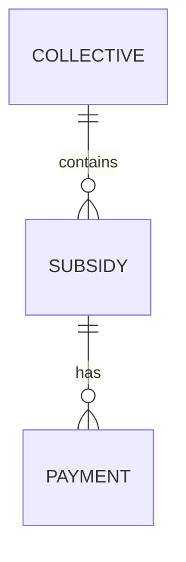

# Data preparation

SciPost exposes an API with all the subsidies and payments they receive.

Those endpoints are private and need elevated rights to access them.

## Data fetching

We use 3 sources of data to have the exhaustive list of all supports SciPost has received since its inception:

- The subsidies - A subsidy is a contract or agreement between the supporter and SciPost. It contains the agreed amount of support.

- The payments - The actual transfer received by SciPost. This is attached to a subsidy.

- The collectives - A collective is a group of subsidy bundled together, usually because it's initiaded by a common intermediary. We fetch this data exactly for the intermediary info. A subsidy can be attached to a a collective



The data fetching uses OAuth2 authentication against SciPost identity provider with our SciPost user.


## Entity matching

The SciPost data already contains ROR identifier.

We provide additional entity ID <-> (ROR ID, wikidata ID, website) mapping in the [entity_mapping.py](./entity_mapping.py) file.

The script will log the entities without enrichment data.


## Processing

The processing starts with preparing each datasets (payments, subsidies and collectives).

We have to merge the payments and subsidies datasets to get all the supports received by SciPost because of the following facts:

- A subsidy can be `received`, without any referenced payment. We need to account for those ones.

- A payment can be linked to a subsidy with a 0€ amount. This usually corresponds to an entity paying for others. In that case the other entities' subsidy will not have a payment.

    We then want to ignore these payments as we account for the `received` subsidies with no payments.

Thus we concatenate the payments with all the subsidies that have no known payments.

Then we filter the dataset to get only accurate transfers:

- we filter on `received` subsidy or `paid` payments to end up with actually performed support.

- we filter the correct rows as described above with this line:

    ```python
        (data["subsidy_amount"] != 0) | (["has_payment"] == False)
    ```

Finally, we join the collective data to account for the intermediary, if any.