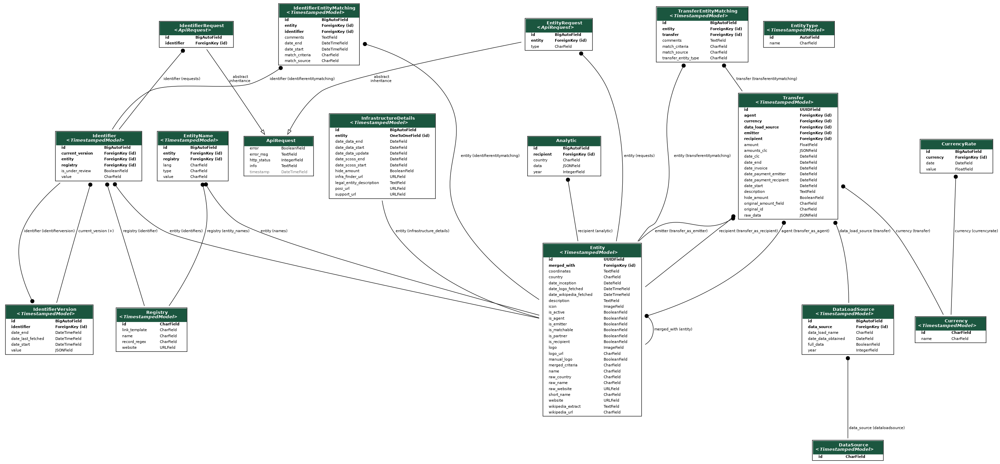

The following image (accessible [here](./2025-07-10_tsosi_database.png)) shows the models used by TSOSI:



This has been generated with the following management command from `django_extensions` package. Note that it requires the `graphviz` system library to be installed.

```bash
poetry run python manage.py graph_models tsosi --disable-abstract-fields -o tsosi_database.png -X TimestampedModel
```

# Core
The base models of our data schema are the following:

* [Transfer](./transfer.py)

    Represents the individual financial transfers made by a supporter (`emitter`) to an OSI (`recipient`) optionally through an intermediary (`agent`).

    Note that the amount is optionnal. We usually ask for the amount but we offer the option to hide its value with the `hide_amount` boolean.

* [Entity](./entity.py)

    It represents any entity involved in a **Transfer** (supporter, recipient or agent).

    Many fields are "calculated" or "computed" fields derived from its identifiers.

* [Identifier](./identifier.py)

    It represents an unique identifier of a given registry attached to an entity.

    The registries we use are the [ROR](https://ror.org) and [Wikidata](https://wikidata.org).

    Example: the entity Université Grenoble Alpes has the identifier of value `02rx3b187` and registry `ror` attached to it.

* [DataSource](./source.py) and [DataLoadSource](./source.py)

    It represents respectively allowed data source and ingested datasets.

    They are used to flag the source of the ingested records and to prevent ingestion of already ingested datasets. See Data ingestion details.

# Matching history models

We use two models to store the "history" of our performed "matching": the matching between an entity and a transfer, and the matching between an identifier and an entity.

* [TransferEntityMatching](./transfer.py)

    This model is used to store the successive matching of an entity to a transfer over time.
    
    For example, 2 entities can be merged (see [merging.py](/backend/tsosi/data/enrichment/merging.py)).
    When that happens, all the transfers referencing the first entity are updated to reference the one it was merged with and we add a new entry to the **TransferEntityMatching** table for every affected **Transfer**.

* [IdentifierEntityMatching](./identifier.py)

    Similarly, this model is used to store the successive matching of an identifier to an entity over time.

    The matching source can be the input (manually enriched data, automatically matched ROR record, included data by our data provider) or enrichment tasks (ROR records contain related Wikidata identifiers and vice-versa).


# [ApiRequest](./api_request.py)

We store API requests made during the enrichment process in this table.

Tasks involving external API requests have a max retry policy that uses this table to authorize or not the request. 

# [Currency](./currency.py)

This could be a standalone app.
We store the list of available Currency and their rates with respect to USD.


# [Analytic](./analytics.py)

This model stores regularly computed metrics.

As of 2025-07-10, this is used to store computed buckets of aggregated support amount per year per country per infrastructure.