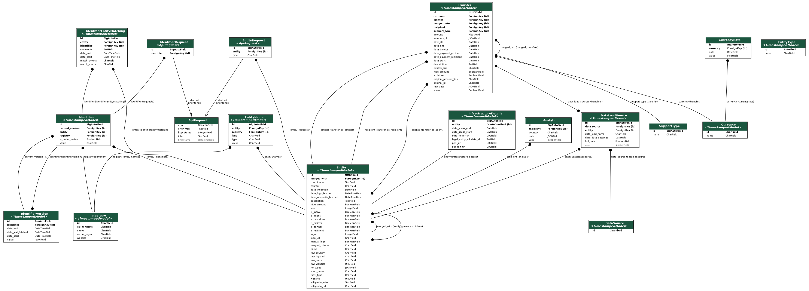

The following image (accessible [here](./tsosi_database.png)) shows the models used by TSOSI:



This has been generated with the following management command from `django_extensions` package. Note that it requires the `graphviz` system library to be installed (`sudo apt install graphviz`).

Regenerate it whenever models are modified, from the `backend/` directory:

```bash
poetry run python manage.py graph_models tsosi --disable-abstract-fields -o tsosi/models/tsosi_database.png -X TimestampedModel
```

# Core

The base models of our data schema are the following:

- [Transfer](./transfer.py)

  Represents the individual financial transfers made by a supporter (`emitter`) to an OSI (`recipient`) optionally through intermediaries (`agents`).

  Note that the amount is optional. We usually ask for the amount but we offer the option to hide its value with the `hide_amount` boolean.

- [Entity](./entity.py)

  It represents any entity involved in a **Transfer** (supporter, recipient or agent).

  Many fields are "calculated" or "computed" fields derived from its identifiers.

- [Identifier](./identifier.py)

  It represents an unique identifier of a given registry attached to an entity.

  The external registries we use are the [ROR](https://ror.org) and [Wikidata](https://wikidata.org).
  Entities also get an internal TSOSI ID (registry `tsosi`, format `T` + 6 digits) generated with the `generate_tsosi_id` management command.

  Example: the entity Université Grenoble Alpes has the identifier of value `02rx3b187` and registry `ror` attached to it.

  The successive versions of a PID record fetched from its registry are stored in `IdentifierVersion`.

- [DataSource](./source.py) and [DataLoadSource](./source.py)

  It represents respectively allowed data source and ingested datasets.

  They are used to flag the source of the ingested records and to prevent ingestion of already ingested datasets. See Data ingestion details.

# Matching history models

We store the "history" of the matching between an identifier and an entity. The former transfer ↔ entity matching model (`TransferEntityMatching`) has been removed.

- [IdentifierEntityMatching](./identifier.py)

  This model is used to store the successive matching of an identifier to an entity over time.

  The matching source can be the input (manually enriched data, automatically matched ROR record, included data by our data provider) or enrichment tasks (ROR records contain related Wikidata identifiers and vice-versa).

# [ApiRequest](./api_request.py)

We store API requests made during the enrichment process in this table.

Tasks involving external API requests have a max retry policy that uses this table to authorize or not the request.

# [Currency](./currency.py)

This could be a standalone app.
We store the list of available currencies (`Currency`) and their historical rates with respect to USD (`CurrencyRate`).

# [Analytic](./analytics.py)

This model stores regularly computed metrics.

It is used to store computed buckets of aggregated support amount per year per country per infrastructure.
